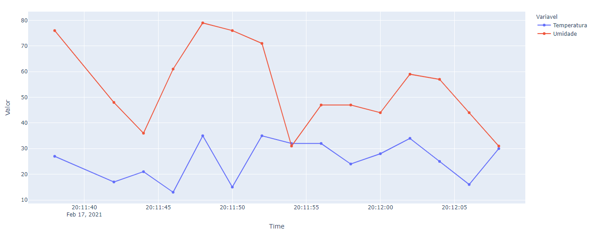

# 📁 About the project

The project consists in an opc_ua client and opc_ua server who will communicate with each other using an OPCUA communication, based of the Python library [opcua](https://pypi.org/project/opcua). The server side will be sending random values of temperature and humidity to the client side, wich will adquire this values and then plot them in a line chart using the [plotly](https://plotly.com/) library, the plotly lib is always described as the frontend for data science project, and it is really easy to use and plot clean graphs as html elements.

You can learn more of what the [OPC UA communication protocol](https://blog.prediktor.com/opc-ua-explained?utm_term=&utm_campaign=DSA+%7C+EMEA+%7C+All+pages&utm_source=adwords&utm_medium=ppc&hsa_acc=5466196597&hsa_cam=16372855602&hsa_grp=139013070412&hsa_ad=584024887085&hsa_src=g&hsa_tgt=dsa-1456167871416&hsa_kw=&hsa_mt=&hsa_net=adwords&hsa_ver=3&gclid=EAIaIQobChMI5ti6jb35_gIVgdOyCh3SUw-aEAAYAiAAEgLwUvD_BwE)

# 📋 Run explanation

At first you need to set your IP address at the consts.py file to run it locally.

The you can run the server.py, who will set values for the temperature, humidity and time after each 2 second (defined time), parallel to that you can run the client.py, who will receive the first 15 values sent by the server and plot it in a plotly line graph. The opcua python lib is really simple to set the Client and Server connection.

# 💻 Requirements

Clone this repository with:
```bash
git clone https://github.com/masnik1/opcua_python_temperature_and_humidity.git
```
To install the required python libs just go to your project folder via cmd and run:
```bash
pip install -r requirements.txt
```
Or you can install it manually via cmd and pip
```bash
pip install plotly
pip install opcua
pip install pandas
pip install datetime
```
# 📷 Graph pictures

It is important to remember that this temperature and humidity values are simply mocked via the random lib, and do not represent any real situation, an update to the project would be to add an temperature/humidity sensor via and Arduino/ESP board and send the real values to the client.

